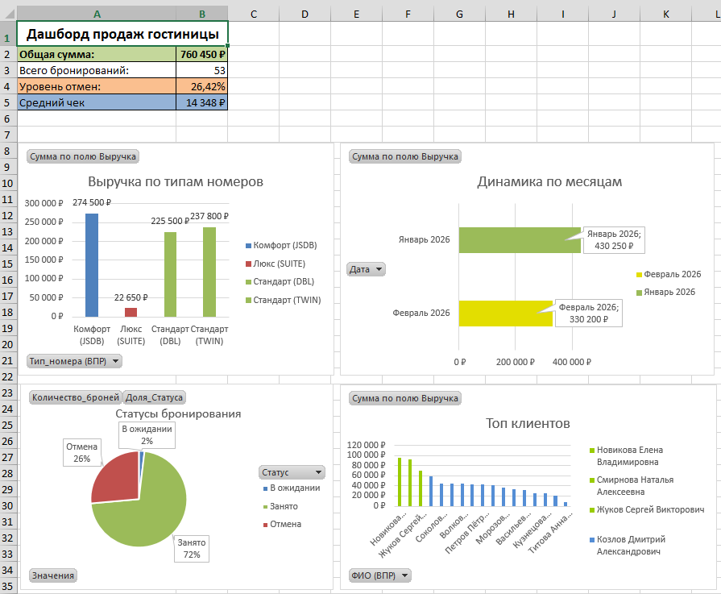
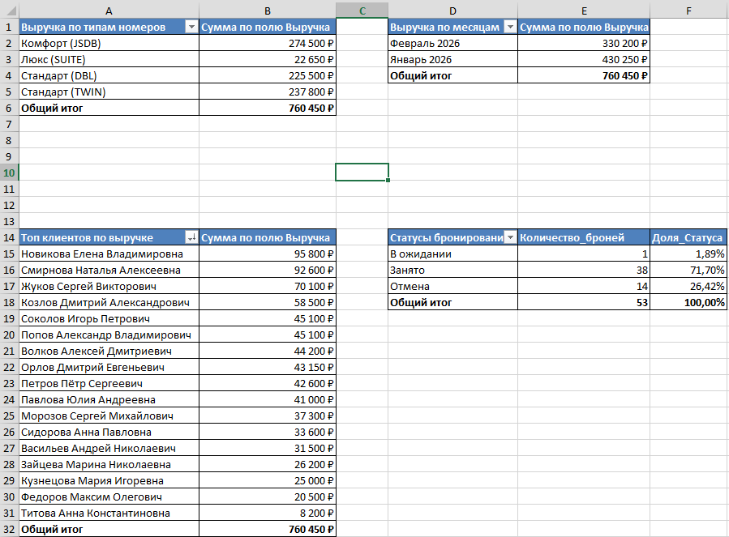
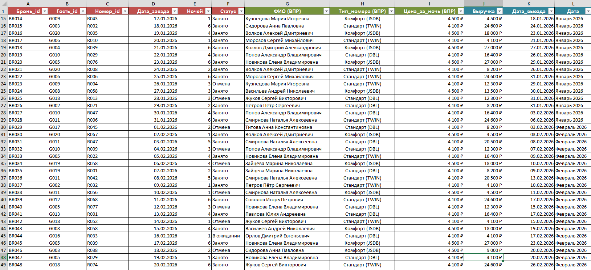

# Анализ продаж гостиницы (Excel)
Некорпоративные данные!
> Проект для портфолио Junior Data Analyst. Демонстрация навыков работы с данными в Excel: от сбора и очистки до визуализации и бизнес-инсайтов.

## О проекте
Анализ эффективности продаж гостиницы на основе данных о бронировании. 
Цель - найти проблемные зоны, предложить решения и выявить ключевые метрики бизнеса.

**Период анализа:** Январь - Февраль 2026

**Объём данных:** 53 бронирования, 20 гостей, 80 номеров.

## Инструменты
- **Excel:** сводные таблицы (Pivot Tables), ВПР (VLOOKUP), формулы, условное форматирование
- **Визуализация:** интерактивные дашборды, диаграммы, KPI-карточки
- **Анализ:** Расчёт выручки, уровня отмен, сверднего чека

## Ключевые метрики (KPI)
**Общая выручка** - 760 450 руб.

**Всего бронирований** - 53

**Уровень отмен** - 26.42%

**Свердний чек** - 14 348 руб.

## Ключевые выводы и инсайты

### Динамика выручки по месяцам
**Январь 2026** - 430 250 руб.
**Февраль 2026** - 330 200 руб.

 **Инсайт:** Январь на +100 050 руб. прибыльнее февраля.
 
**Причина:** Новогодные праздники (12 дней) увеличили спрос на бронирования и путешествия в целом. Может быть, что именно в январь были большие заезды групп, что увеличило прибыль в данном месяце.

### Выручка по типам номеров
1. Комфорт (JSDB) - 274 500 руб. (Лидер)
2. Стандарт (TWIN) - 237 800 руб.
3. Стандарт (DBL) - 225 500 руб.
4. Люкс (SUITE) - 22 650 Руб. (Аутсайдер)

 **Инсайт:** Люксы приносят всего 3% выручки.
 
**Причины:** 
- Малое количество номеров (4 из 80 = 5% фонда)
- Высокая цена (7 550 руб.) при низкой ценности
- Гости выбирают "Комфорт" как логичное противопоставлению Люксу. Единственное отличие Люкса от Комфорта в кровати большей площади (King_Size).

### Проблема: Низкая загрузки люксов

**Рекомандации:**
- Пересмотреть ценообразование (снизить на 15-25% в несезонность)
- Если руководство не хочет понижать стоимость, то необходимо добавить доп. услуги, которые будут выгодны только в Люксе (завтрак, косметический набор, поздний выезд  т.д).
- Комфортов намного больше Люксов, можно переделать 2-3 номер категории "Комфорт" в "Люкс", докупив кровати и матрасы King_size. Далее посмотреть измениться ли ситуация, если да, то дополнить ещё 2-3 номерами.

### Проблема: 26,42% отмен бронирований

**Гипотезы:**
1. **Погодные условия:** Сильные снегопады в Москве и МО (Январь 2026) из-за сильного циклона "Френсис".
Так же циклон "Валли", который обрушился на Москву в Феврале 2026 г. из-за чего объявили "Оранжевый" уровень погодной опасности.
2. **Транспорт:** Массовые отмены/задержки рейсов в аэропортах.
3. **Геополитика:** Сложность с логистикой, долгое ожидание багажа.

**Рекомендации:**
- Ввести гибкую политику отмен броней с минимальным удержанием стоимости в зимный период. Можно сделать бесплатную отмену и день в день. Это повысит клиентоориентированность.
- Ввести бесплатный перенос брони, если это позволяет по загруженности.
Это временная мера, поэтому проявляние гибкости в этой ситуации, позволит минимизировать отмену броней.

### Топ-3 клиентов приносят 34% выручки
1. Новикова Елена - 95 800 руб.
2. Смирнова Наталья - 92 600 руб.
3. Жуков Сергей - 70 100 руб.

**Рекомендации**: Можно запустить программу лояльности для прибыльных гостей (преорететность в бронировании при ограничеснности номеров, бонусные карты).

## Скриншоты проекта

### Дашборд с KPI и визуализацией

### Сводные таблицы для анализа

### Исходные данные с формулами (ВПР и т.д)

## Автор
**Арсений Мацакян**
Junior Data Analyst  
📧 arseniymatsakyan@gmail.com  
💬 [Telegram](https://t.me/Melman545)  
🎓 МТУСИ'26  
🔗 [GitHub](https://github.com/ArseniyMatsakyan)

* Проект выполнен в учебных целях. Данные сгенерированы искусственно. Практика принятий решений и возможные причины реальны из моего опыта работы Ст. Администратором Гостиницы!*
